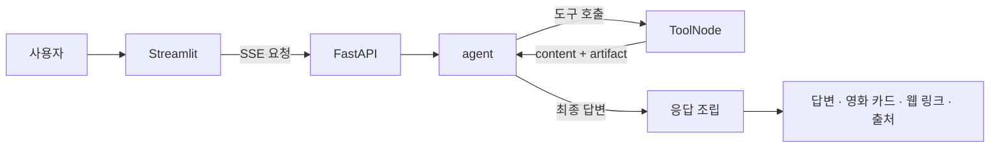
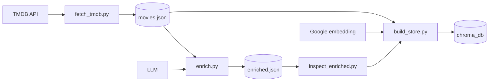

# CineBot — 질문에 맞는 검색을 고르는 영화 추천 RAG

CineBot은 영화 질문을 한 검색 방식으로 처리하지 않습니다. 질문의 목적에 따라
**TMDB 조건 검색**, **로컬 Chroma 분위기 검색**, **웹 검색**을 골라 사용하고,
검색 결과를 근거로 한국어 답변과 영화 카드를 만듭니다.

```text
"봉준호 감독 영화 알려줘"        → TMDB 조건 검색
"비 오는 날 볼 잔잔한 영화"       → 로컬 Chroma 분위기 검색
"잔인하지 않은 액션 영화"         → 분위기 검색 + 폭력성 필터
"기생충 평단 반응은 어땠어?"      → 웹 검색
```

## 왜 만들었나

영화 추천에는 서로 다른 종류의 정보가 필요합니다.

- 감독·배우·장르·연도·평점·OTT처럼 구조화된 조건
- `비 오는 날 혼자 보기 좋은 영화`처럼 감상 경험에 가까운 조건
- 최신 수상 결과·평단 반응·작품 해석처럼 웹에서 확인해야 하는 정보

CineBot은 이 세 문제를 하나의 벡터 검색으로 억지로 풀지 않고, 각 데이터 소스가
잘하는 역할을 분리했습니다. 답변에 소개한 영화만 같은 순서의 카드로 보여주며,
웹 페이지 링크는 영화 카드와 별도로 보존합니다.

## 검색 경로

| 도구 | 데이터 | 담당하는 질문 |
|---|---|---|
| `search_movies` | TMDB | 영화 목록, 조건 검색, 정렬, 개수, 상영 상태, 국내 OTT |
| `get_movie_details` | TMDB | 한 영화의 감독, 출연, 줄거리, 상영시간, 시청처 |
| `search_by_vibe` | 로컬 Chroma | 분위기, 감정선, 감상 상황, 폭력성·슬픔·복잡성 조건 |
| `web_search` | Tavily | 최신 수상, 평단 반응, 화제, 비하인드, 작품 해석 |

로컬 분위기 검색은 현재 영화 501편의 감상 프로파일을 색인합니다. 자연어 분위기는
벡터 유사도로 찾고, `잔인하지 않은` 같은 부정 조건은 `max_violence`와 같은 수치
필터로 처리합니다.

## 동작 방식



LangGraph는 `agent`와 `tools` 두 노드로 구성됩니다. LLM이 필요한 도구를 고르고,
도구 결과가 부족하면 다시 호출한 뒤 최종 답변을 만듭니다. 응답 조립 단계에서는
이번 턴에 성공한 artifact만 사용합니다. 영화 카드는 답변의 `제목(개봉연도)`와
일치하는 후보만 답변 순서대로 남깁니다.

## 오프라인 데이터 파이프라인

온라인 요청은 저장소에 준비된 영화 JSON과 Chroma 색인을 읽기만 합니다. 영화
카탈로그를 갱신할 때만 다음 파이프라인을 순서대로 실행합니다.



1. `fetch_tmdb.py`가 여러 수집 축에서 영화 정보를 모읍니다.
2. `enrich.py`가 영화별 분위기·감정선·감상 상황과 수치 프로파일을 만듭니다.
3. `inspect_enriched.py`로 태그와 수치 분포를 검토합니다.
4. `build_store.py`가 자연어 프로파일은 임베딩하고 수치 조건은 메타데이터로 저장합니다.

```bash
uv run python -m scripts.fetch_tmdb
uv run python -m scripts.enrich
uv run python -m scripts.inspect_enriched
uv run python -m scripts.build_store
```

현재 실행에 필요한 `data/movies.json`, `data/enriched.json`, `chroma_db/`가 저장소에
포함돼 있으므로 일반적인 로컬 실행에서는 이 과정을 다시 수행할 필요가 없습니다.
색인 지문이 데이터·문서 스키마·임베딩 설정과 다르면 런타임은 기존 색인을 사용하지
않고 재색인을 요구합니다.

## 사용자 기능

- 검색 상태와 답변 토큰을 보여주는 SSE 스트리밍
- 같은 `session_id`에서 이어지는 멀티턴 대화
- 포스터·감독·출연·장르·평점을 담은 영화 카드
- 실제 웹 검색 결과 링크와 데이터 출처 표기
- 최근 대화 최대 50개와 읽기 전용 다시 보기
- 보고 싶은 영화 보관함과 마크다운 내려받기
- 익명 브라우저 ID별 대화 기록·보관함·일일 사용량 분리

익명 브라우저 ID는 사용자 데이터를 나누기 위한 장치이지 인증이 아닙니다. 공유
패스코드 역시 UI를 가리는 최소 장치이며 FastAPI 자체를 보호하지 않습니다.

## 기술 스택

- Python 3.14, uv
- LangGraph, LangChain tools/checkpointer
- OpenAI `gpt-5.6-luna` 기본 답변 모델
- Google `gemini-embedding-001`, Chroma
- TMDB API, Tavily
- FastAPI, Uvicorn, Streamlit, SSE
- Docker Compose, Caddy HTTPS

## 빠른 시작

Python 3.14 이상과 [uv](https://docs.astral.sh/uv/)가 필요합니다.

```bash
uv sync --locked
cp .env.example .env
```

`.env`에 기본 실행에 필요한 키를 입력합니다.

```dotenv
TMDB_API_KEY=
OPENAI_API_KEY=
GOOGLE_API_KEY=
TAVILY_API_KEY=
```

API와 UI를 서로 다른 터미널에서 실행합니다.

```bash
LANGSMITH_TRACING=false uv run uvicorn rag.api:app --reload
```

```bash
uv run streamlit run ui/app.py
```

- API: `http://127.0.0.1:8000`
- UI: `http://localhost:8501`
- 헬스 체크: `GET http://127.0.0.1:8000/health`

## 환경 변수

전체 목록과 설명은 [`.env.example`](.env.example)에 있습니다. 기본 실행에는 다음
네 API 키가 필요합니다.

| 변수 | 용도 |
|---|---|
| `TMDB_API_KEY` | 영화 목록·상세·상영 상태·국내 OTT 조회 |
| `OPENAI_API_KEY` | 기본 답변 모델 호출 |
| `GOOGLE_API_KEY` | 로컬 분위기 검색의 질의 임베딩 |
| `TAVILY_API_KEY` | 최신 정보와 평단 반응 웹 검색 |

자주 바꾸는 런타임 설정은 다음과 같습니다.

| 변수 | 기본값 | 설명 |
|---|---|---|
| `RAG_API_URL` | `http://127.0.0.1:8000` | Streamlit이 호출할 FastAPI 주소 |
| `LLM_PROVIDER` | `openai` | 답변 모델 제공자: `openai`, `anthropic`, `google` |
| `OPENAI_MODEL` | `gpt-5.6-luna` | 기본 답변 모델 |
| `GOOGLE_EMBEDDING_MODEL` | `gemini-embedding-001` | 색인과 검색에 공통으로 쓰는 임베딩 모델 |
| `CHECKPOINTER` | `memory` | 멀티턴 상태를 메모리 또는 SQLite에 저장 |
| `CINEBOT_PASSCODE` | 미지정 | 로컬에서는 선택, Compose에서는 필수인 공유 UI 잠금 |
| `DAILY_QUESTION_LIMIT` | `30` | 익명 사용자별 UTC 일일 질문 수 |
| `SESSION_QUESTION_LIMIT` | `12` | 한 대화의 질문 수 |
| `MAX_CONCURRENT_REQUESTS` | `2` | 단일 API 프로세스의 동시 질문 처리 수 |
| `LANGSMITH_TRACING` | SDK 환경값 | 추적이 필요 없으면 `false` |

OpenAI 대신 다른 제공자를 선택하면 해당 API 키도 설정해야 합니다. Google 키는
미리 만들어 둔 Chroma를 조회할 때도 사용자 질문을 임베딩해야 하므로 필요합니다.

## Docker

`.env`에 API 키와 `CINEBOT_PASSCODE`를 설정한 뒤 실행합니다.

```bash
docker compose up --build
```

로컬 Compose는 UI만 `127.0.0.1:8501`에 공개하고 FastAPI는 내부 네트워크에 둡니다.
영화 JSON과 원본 Chroma는 읽기 전용으로 마운트하고, 체크포인트와 사용자 데이터는
별도 볼륨에 보존합니다.

`compose.ec2.yaml`과 `Caddyfile`은 단일 EC2 HTTPS 배포를 재현하기 위한 템플릿입니다.
현재 외부 인프라가 실행 중임을 의미하지 않으며, 배포할 때는 이미지와 데이터 스냅샷의
버전을 함께 맞춰야 합니다.

## 평가와 테스트

고정 12문항 평가에서 검색 경로는 12/12로 선택했고 AI judge 평균은 0.91/1.00이었습니다.
필수 인자는 32/33, 호출 절제는 10/12였으며, 작은 단일 실행의 방향성 기준선으로
해석합니다. Target과 judge가 같은 OpenAI 제공자라는 편향, 웹 검색의 시간 변동성,
12문항을 한 번만 실행했다는 한계가 있습니다.

```bash
LANGSMITH_TRACING=false uv run python -m unittest discover -s tests -t .
```

테스트는 도구 인자와 오류 처리, artifact 기반 출처, 답변·카드 순서, SSE 계약,
멀티턴 상태, 사용자 격리, 사용량 제한과 Compose 구성을 다룹니다.

## 알려진 한계

- LLM의 도구 선택은 완전히 결정적이지 않습니다.
- 로컬 분위기 검색은 현재 501편의 고정 카탈로그 안에서만 동작합니다.
- TMDB·JustWatch 정보는 누락되거나 바뀔 수 있고, 웹 결과도 검색 시점에 영향을 받습니다.
- 스트리밍에는 사용자 중지, 자동 재연결과 이어받기가 없습니다.
- 공유 패스코드와 익명 쿠키는 정식 인증이 아닙니다.
- SQLite·로컬 파일·단일 API 프로세스를 사용하는 소규모 데모 구조입니다.
- `/health`는 프로세스 응답만 확인하며 외부 API와 Chroma 준비 상태까지 검사하지 않습니다.

## 프로젝트 구조

```text
rag/                         온라인 요청에서 사용하는 런타임 코드
├── graph.py                 2노드 LangGraph, 스트리밍, 응답·근거 조립
├── tools.py                 TMDB·Chroma·Tavily 검색 도구 4개
├── api.py                   FastAPI 요청 검증, 일반 응답과 SSE
├── tmdb.py                  TMDB 클라이언트와 이름→ID 해석
├── store.py                 Chroma 로드와 색인 지문 검증
├── sources.py               영화 결과를 공통 카드 형식으로 변환
├── limits.py                일일·세션·동시 요청 제한
├── providers.py             답변 LLM과 Google 임베딩 생성
└── config.py                .env 기반 설정

ui/                          Streamlit 사용자 화면
├── app.py                   채팅, 카드, 사이드바, 패스코드
├── api_client.py            FastAPI 일반 요청과 SSE 클라이언트
├── history.py               사용자별 대화 기록
├── identity.py              익명 브라우저 ID
└── watchlist.py             보고 싶은 영화 보관함

scripts/                     서버 기동 전 필요할 때 실행하는 배치·평가 CLI
├── fetch_tmdb.py            영화 수집
├── enrich.py                무드 프로파일 생성
├── inspect_enriched.py      프로파일 분포 검토
├── build_store.py           Chroma 색인 생성
├── evaluate_routing.py      도구 선택과 인자 평가
└── evaluate.py              고정 평가 실행

eval/dataset.jsonl           고정 평가 질문과 개발자 규칙
tests/                       도구·그래프·API·UI·배포 계약 테스트
data/                        영화·무드 프로파일 스냅샷
chroma_db/                   로컬 분위기 검색 색인
compose.yaml                 로컬 Docker Compose
compose.ec2.yaml             단일 EC2 HTTPS 템플릿
Caddyfile                    HTTPS reverse proxy 설정
```

`rag/`와 `ui/`는 온라인 요청 경로이며 `scripts/`를 import하지 않습니다. 데이터 준비와
평가 작업을 런타임에서 분리해 서버 시작 시 수집·프로파일 생성·재색인이 실행되지 않게
했습니다.
